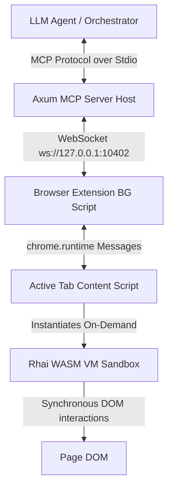

# loki-auto (Open-Source Edition)

`loki-auto` is an ultra-lightweight, zero-dependency **"Serverless in Browser"** web automation runtime designed for the AI Agent era. It executes episodic, transient LLM tool actions inside a secure **Rhai VM (compiled to WebAssembly)** sandbox container directly within the browser's foreground page context, completely bypassing heavy headless browser resource overhead.

---

## 🛠 Architecture

loki-auto uses a stateless, event-driven Oneshot CGI paradigm:



1. **Layer 1: Host Environment** – Rust Axum MCP server handling Model Context Protocol (MCP) tool bindings and bridging commands over local WebSockets.
2. **Layer 2: Browser Background** – Extension background script managing tab states and routing target instructions.
3. **Layer 3: Browser Sandbox** – The content script instantiates a lightweight WASM-compiled Rhai VM per prompt invocation, executes DOM operations, captures results/logs, and purges the VM from memory instantly.

---

## 🚀 Getting Started

### 1. Prerequisites
Ensure you have the following installed on your system:
* [Bun](https://bun.sh/) (Workspace package manager)
* [Rust & Cargo](https://rustup.rs/) (with `wasm32-unknown-unknown` target installed: `rustup target add wasm32-unknown-unknown`)
* [wasm-pack](https://rustwasm.github.io/wasm-pack/installer/) (for Rust-to-WASM compilation)

### 2. Compilation and Build

Build the WebAssembly sandbox first, and then compile the extension assets:

```bash
# 1. Compile Rust Sandbox to WebAssembly
cd packages/sandbox
wasm-pack build --target web

# 2. Return to root, install dependencies and compile the Chrome/Firefox extensions
cd ../..
bun install
bun run build
```

This will output two fully-compiled, self-contained extension directories under the root folder:
* **Chrome (Manifest V3)**: `./dist/chrome`
* **Firefox (Manifest V2)**: `./dist/firefox`

### 3. Load the Browser Extension

* **Firefox**: Open `about:debugging#/runtime/this-firefox`, click **"Load Temporary Add-on..."**, and select the compiled package `loki-auto.xpi` at the root of the project (or select `./dist/firefox/manifest.json`).
* **Chrome**: Open `chrome://extensions/`, enable **Developer mode**, click **"Load unpacked"**, and select the `./dist/chrome` folder.

### 4. Launch the Local MCP Server

Start the Axum host to begin listening for browser connections and LLM tool calls:

```bash
# Start the MCP host (default port: 10402)
cargo run --bin loki-mcp-server
```

---

## 🔌 MCP Tool Specifications

loki-auto exposes standard Model Context Protocol (MCP) tools:

* `list_tabs` - Lists all open browser tabs and their focused states.
* `open_tab(url, active)` - Opens a new tab with the specified URL.
* `close_tab(tab_id)` - Closes a target tab by ID.
* `activate_tab(tab_id)` - Focuses a browser tab to the foreground.
* `execute_loki_oneshot(target_tab_id, target_url_pattern, rhai_script, payload)` - Runs a Rhai automation script synchronously inside the sandboxed VM of the target tab.

---

## 📝 Rhai Sandbox DOM APIs

Scripts running inside the WASM sandbox have access to the following synchronous DOM hooks:

* `sleep(ms)` - Suspends execution for the specified milliseconds.
* `log(message)` - Prints a message/object to the execution console logs.
* `dom_to_string() -> String` - Returns a cleaned, token-optimized (AEO-optimized) HTML tree of the current page.
* `element_exists(selector) -> bool` - Immediate check if a element matches the CSS selector.
* `wait_element(selector, [timeout_ms]) -> bool` - Blocks until the element is present, or throws a timeout exception.
* `click(selector, [timeout_ms]) -> bool` - Wait and click on the selected element.
* `type_text(selector, text, [timeout_ms]) -> bool` - Wait and instantly set text into an input or textarea, triggering input events (recommended for long texts/articles).
* `type_as_human(selector, text, [timeout_ms]) -> bool` - Wait and type text character-by-character with randomized human typing delays and standard keydown/keyup events (recommended for search boxes and login inputs).
* `get_text(selector, [timeout_ms]) -> String` - Extract inner text content.
* `get_value(selector, [timeout_ms]) -> String` - Extract form input value.
* `get_attribute(selector, attr, [timeout_ms]) -> String` - Extract specific attribute value.
* `scroll_to(selector, [timeout_ms]) -> bool` - Scroll the viewport smoothly to the targeted element.
* `get_loki_data(dom_selector, [timeout_ms]) -> String` - Scopes target DOM and extracts child nodes bearing `data-loki` attributes in a clean, Markdown-friendly format.

> [!NOTE]
> The `[timeout_ms]` parameter in DOM APIs (e.g., `click`, `type_text`, `type_as_human`) specifies the **maximum wait time for the target element to appear in the DOM** before throwing a `TimeoutError` (defaults to `5000` ms). For `type_as_human`, this is the element detection limit and does *not* restrict the typing execution time itself (which runs asynchronously and is only limited by the global 45-second MCP oneshot task timeout).

### Example Rhai Script
```rust
print("Interacting with search input...");
if wait_element("textarea[name='q']", 2000) {
  type_text("textarea[name='q']", "weather in Boston today");
  sleep(500);
  click("input[name='btnK']");
}
```

---

## 🛡 Security and Isolation

* **Strict Sandbox**: The Rhai runtime inside WebAssembly has no access to standard JS APIs, cookies, localStorage, or system files unless explicitly exposed through bridge bindings.
* **No Network Access**: The sandbox cannot perform `fetch` or AJAX requests. All actions occur inside the page context, and results are returned via the secure extension channel.
